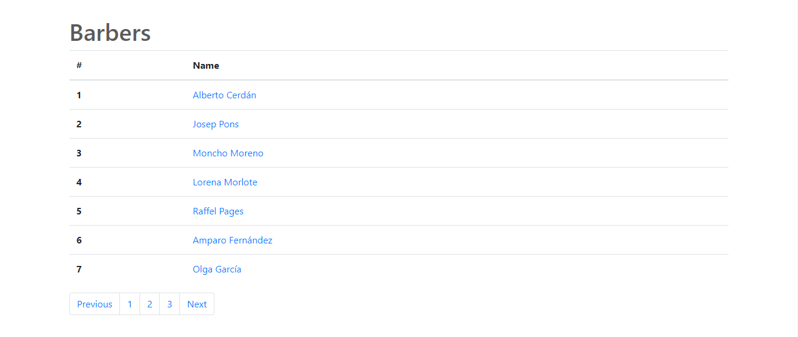
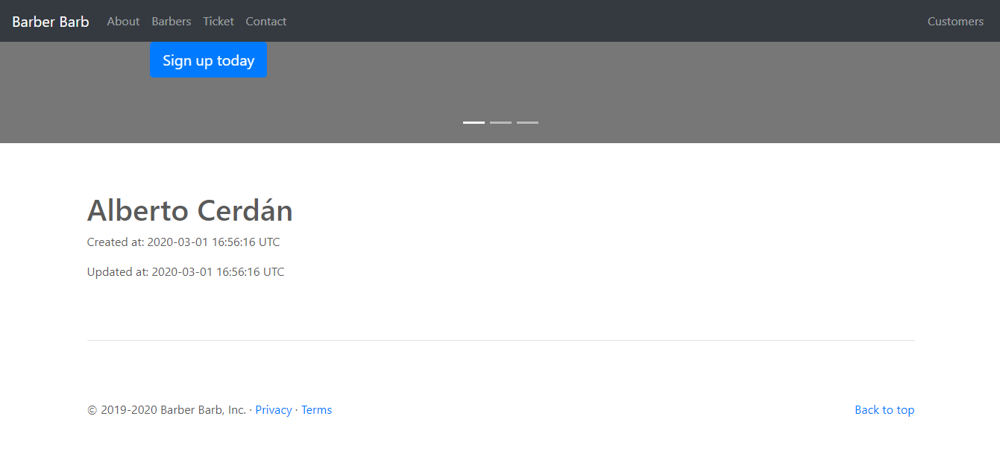
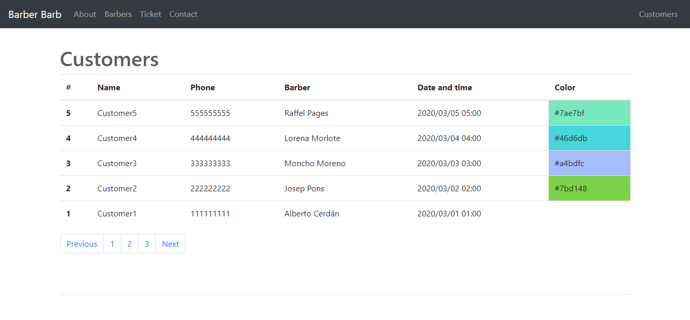

# Barber Barb App

**Barber Barb App** es una plantilla para peliquerias simple de usar, ligera, rápida y libre que está creado en El Reino de España.

**Barber Barb App** se desarrolla con las siguientes fantasticas tecnologías:

* Ruby
* Sinatra
* SQLite
* Bootstrap
* jQuery

#### De la caja:

* Lista de peliqueros
* Página personal del peliquero
* Formulario de ticket
* Formulario de contacto
* Verificación de formularios
* Lista de consumidores

#### Licensia:

Eres libre y tienes derecho de hacer todo lo que quieres.

#### Pantallas:

Lista de peluqueros ->

Página del peluquero ->

Formulario de cita ->

Formulario de contacto ->

Lista de citas ->
