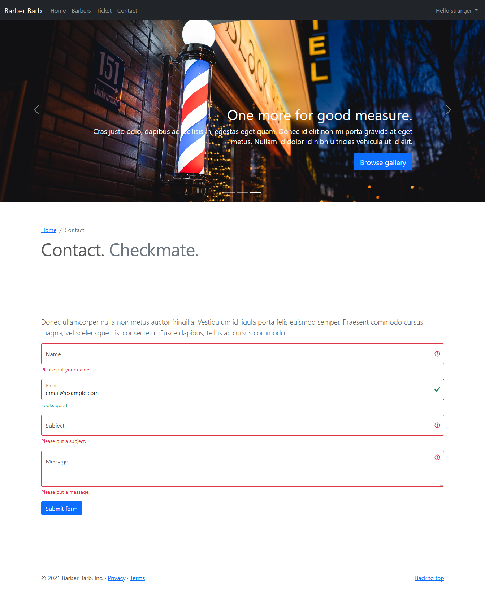

# Barber Barb

**Barber Barb** es una plantilla para peliquerias simple de usar, ligera y rápida. Se desarrolla con las siguientes tecnologías:

* Ruby
* Sinatra
* Bootstrap
* JavaScript
* SQLite

#### De la caja:

* Lista de peliqueros
* Página personal del peliquero
* Formulario de ticket
* Formulario de contacto
* Verificación de formularios del lado de cliente y del servidor
* Lista de consumidores

#### Licensia:

Eres libre y tienes derecho de hacer todo lo que quieres :-)

#### Pantallas:

Página de inicio ->

Lista de peluqueros ->

Página del peluquero ->

Formulario de cita ->

Verificación del formulario ->

Formulario de contacto ->

Verificación del formulario ->

Lista de citas ->
